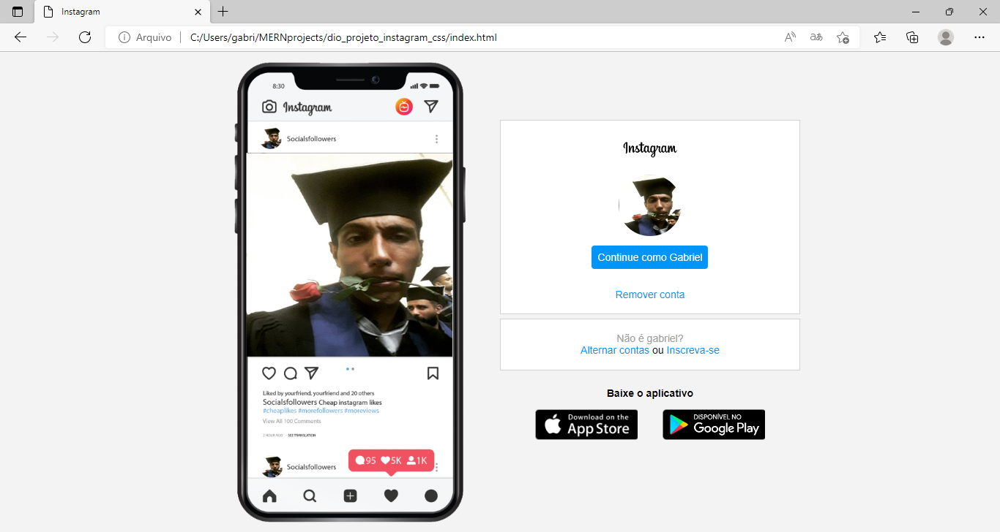

# dio-desafio-instagram-flexbox
Projeto DIO recriando a interface do Instagram.
Foi desenvolvida uma releitura da interface do Instagram utilizando CSS3/HTML5.
O foco do projeto foi a utilização e entendimento do display Flexbox.
Resultado final Visão geral da Interface no Desktop e Mobile  

# Tecnologias

Foi usado na construção do projeto:

- [HTML](https://www.w3schools.com/html/)
- [CSS](https://www.w3schools.com/css/)

# Pre-requisitos

Ter instalado em sua máquina as seguintes ferramentas:

•  Editor de Trabalho: VSCode

# Resultado Desktop

<h1 align="center">
  
</h1>

# Resultado Mobile

<h1 align="center">
  
</h1>
